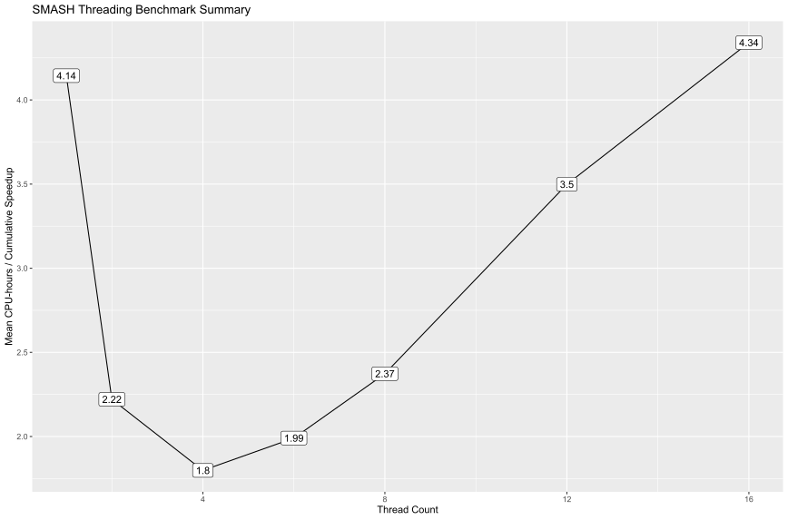

# Sheltzer SMASH

This is a collection of the elements needed from Peter Andrews' [SMASH](https://doi.org/10.1101/gr.201491.115), which requires elements from Peter Andrews' [MUMdex](https://github.com/rhagenson/mumdex) code.

All content under `peter/` belongs to Peter Andrews. Source code under `peter/` may have been modified by Ryan A. Hagenson for the purposes of the Sheltzer Lab.

## Dependencies

+ mumdex/smash
  - build-essential
  - libx11-dev
  - libgsl-dev
  - ghostscript
+ MISC
  - R
    + BiocManager
    + DNAcopy

## Process

The general process for a single SMASH run starting from this repository is as follows:

1. Unpack `peter/bins-n-ref.tar.gz` to a central location
  + This contains two subdirectories, `bins/` and `ref/`, both of which will be used later
2. Change directory into `peter/` and build `smash`, `extract_cn_segments`, and `mummer`
3. Build the genome reference index via `mummer`
  + Run `mummer [-rcref] [-verbose] /absolute/path/to/reference.fa`
  + `-rcref` is "high memory" index, ~120GB for the reference unpacked above
  + Not using `-rcref` is "low memory" index, ~32GB for the reference unpacked above
  + This process will build a subdirectory `/absolute/path/to/reference.fa.bin/` containing the associated index files
4. The easiest way to run SMASH is to use one of the pre-built BASH scripts
  + `peter/cn/smash.sh` is the "standard" run
    - Usage: `smash.sh /path/to/peter/ /path/to/reference.fa /path/to/bins/ bins,to,use ID001 /path/to/ID001/R1.fq.gz /path/to/ID001/R2.fq.gz [num_threads]`
  + `peter/cn/smash_marvel.sh` adds additional steps
    - Usage: `smash_marvel.sh /path/to/peter/ /path/to/reference.fa /path/to/bins/ bins,to,use ID001 /path/to/ID001/R1.fq.gz /path/to/ID001/R2.fq.gz [num_threads]`

## Benchmarking

SMASH has diminishing returns on thread usage as most time is spent in IO across the memory-mapped reference. (It is possible to forego memory mapping via `smash`, however the pre-built BASH scripts do not take this option.)

On a benchmarked example, the following results were recieved via `hyperfine` where only the `[num_threads]` parameter was changed.

| parameter_num_threads | mean        | stddev      | median      | user        | system      | min         | max         |
| --------------------- | ----------- | ----------- | ----------- | ----------- | ----------- | ----------- | ----------- |
| 1                     | 14918.95017 | 646.3076615 | 14733.67796 | 1251.462838 | 1656.75334  | 14177.56567 | 16035.03518 |
| 2                     | 7722.782798 | 210.7823508 | 7732.975703 | 1202.794143 | 1648.677958 | 7467.368446 | 8102.611258 |
| 4                     | 4914.293215 | 144.497086  | 4856.840803 | 1201.658335 | 1691.165742 | 4755.719154 | 5205.411549 |
| 6                     | 4221.590413 | 90.91750457 | 4187.44144  | 1250.378439 | 1801.309565 | 4145.375666 | 4462.437155 |
| 8                     | 3991.534113 | 36.32553087 | 3980.843808 | 1294.940436 | 1841.52768  | 3954.125145 | 4057.709754 |
| 12                    | 3957.081538 | 177.6688093 | 3881.406046 | 1382.837122 | 1713.667732 | 3823.216936 | 4370.94731  |
| 16                    | 3817.09813  | 23.53336835 | 3818.519433 | 1366.036457 | 1693.253564 | 3771.39473  | 3852.890088 |

The baseline command used was:

```
/home/ryan/mumdex/cn/smash.sh \
  /home/ryan/mumdex/ \
  /home/ryan/ref/chrAll-peter.fa \
  /home/ryan/bins/ \
  20000,50000 \
  A20581 \
  /home/ryan/smash/testing/data/Sample_A20581qC20PXT1M1/A20581qC20PXT1M1_S7_L001_R1_001.fastq.gz \
  /home/ryan/smash/testing/data/Sample_A20581qC20PXT1M1/A20581qC20PXT1M1_S7_L001_R2_001.fastq.gz \
  {num_threads}
```

From the above, we can see that despite 16 threads being 2.02 times faster than 2 threads this means ~4 times the total resource usage per unit of work. For example, if we assume a 2 thread run takes 4 hours to complete we would expend 2CPU x 4h or 8 CPU-hours; the same run on 16 threads would complete in roughly half the time or 2 hours however we would expend 16CPU x 2h or 32 CPU-hours. The optimal threading is 4 threads.



## Assorted Notes on Usage

+ `smash.sh` and `smash_marvel.sh` wrap the R1 and R2 files in a call to `zcat` before passing them to `smash` so both files must be GZipped
+ If running SMASH on a cluster, be sure to compile against the oldest nodes to ensure functional ASM on any node, at YSM this is done via `srun -C oldest`
+ It is highly encouraged to use mummer's `-rcref` if possible as it will greatly speed up later steps -- if desired, both mummer with and without `-rcref` can be run

## Plans

There are current plans to create a Nextflow script which will take any number of SMASH runs and automatically run them locally or via a cluster from a single workflow definition. This script will use the 4 thread optimum and 32GB "low memory" reference -- working under the assumption that efficient resource usage is more important than walltime.

## Alternatives

NYGC has prepared a [Docker image](gcr.io/nygc-public/smash:25e1f2f) of SMASH prior to any edits made by Ryan A. Hagenson for application in the Sheltzer Lab. This is the same baseline Ryan A. Hagenson began his edits from and should match the original content under `peter/`.
